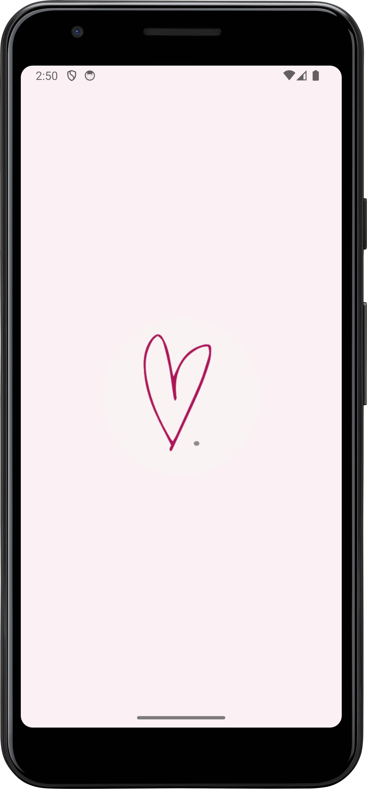
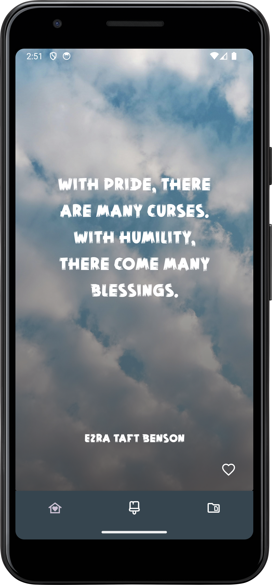
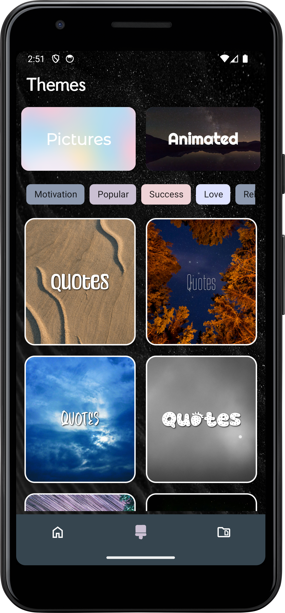
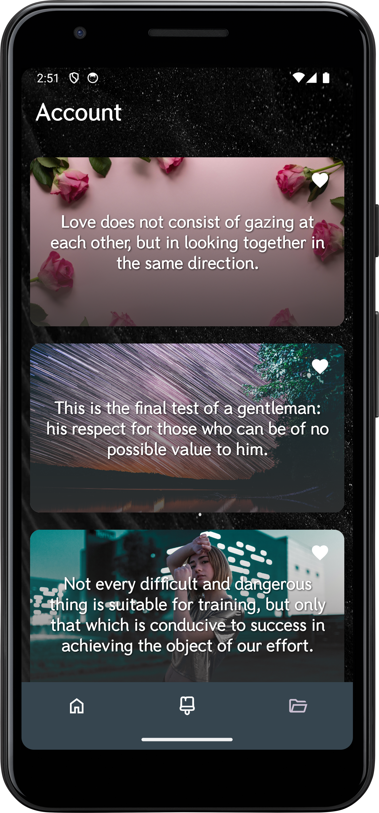
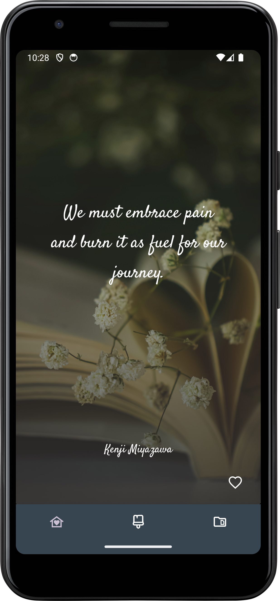

# InspireVerse

InspireVerse is an Android application designed to uplift and inspire you! The app dynamically retrieves inspirational quotes from a Quotes API and beautiful background images from the Pexels API. In addition, InspireVerse leverages Firebase to handle anonymous user authentication and to store each user’s liked quotes—ensuring your favorite inspiration is always saved.

## Overview

**InspireVerse** provides a seamless inspirational experience by combining text and visuals. The app retrieves motivational quotes from a dedicated Quotes API and pairs them with gorgeous imagery fetched from the Pexels API. With a focus on simplicity and user engagement, InspireVerse uses Firebase Authentication to sign users in anonymously and a Firebase Database to store quotes marked as “liked.” The architecture (based on MVVM) and use of Android Jetpack components ensure the app is robust, responsive, and easy to maintain.

## Features

- **Dynamic Inspirational Quotes:**  
  Retrieve quotes in real time from a Quotes API to keep your daily inspiration fresh.

- **Stunning Background Images:**  
  Fetch high-quality images from the Pexels API to provide visually engaging backgrounds that complement each quote.

- **Anonymous User Authentication:**  
  Firebase Authentication is used to sign users in anonymously, creating a frictionless experience.

- **Save Your Favorites:**  
  Users can “like” quotes, and these selections are stored in a Firebase Database for later retrieval.

- **Modern Architecture:**  
  Built using the MVVM pattern and Android Jetpack components such as LiveData and Data Binding, ensuring a clean separation of concerns and reactive UI updates.

## Tech Stack

- **Programming Language:** Kotlin
- **Framework/Architecture:** MVVM
- **UI Components:**  
  - LiveData  
  - Data Binding  
  - Material Design
- **Networking:** Retrofit (for both Quotes API and Pexels API)
- **Backend Services:** Firebase (Authentication and Realtime Database/Firestore)
- **Build Tool:** Gradle

## Architecture

InspireVerse is organized using the Model-View-ViewModel (MVVM) pattern:

- **Model:**  
  Contains data classes for quotes and images as well as API response objects.

- **ViewModel:**  
  Holds business logic and exposes LiveData streams to update the UI reactively. It fetches data from the Repository and processes user actions.

- **View:**  
  Activities and Fragments use Data Binding to directly display data from LiveData objects provided by the ViewModel.

- **Repository:**  
  Handles data operations including network calls via Retrofit to the Quotes API and Pexels API and communication with Firebase to store/retrieve liked quotes.

## API Integrations

- **Quotes API:**  
  InspireVerse pulls inspiring quotes from a public Quotes API. (https://quoteslate.vercel.app/api/)

- **Pexels API:**  
  The app fetches visually appealing images from the Pexels API. (Ensure you configure the API key and any request parameters per Pexels’ documentation.)

## Firebase Integration

- **Authentication:**  
  Users are signed in anonymously using Firebase Authentication. This allows the app to offer personalized features (such as liking quotes) without the need for user account creation.

- **Liked Quotes Storage:**  
  Liked quotes are stored in Firebase Database (or Firestore) under each user’s identifier. This allows users to later retrieve and review their favorite quotes.
  
- **Screenshots:**
Here are some screenshots of AnimatedQuotes:

 
 
 
 
 
- **License:**
This project is licensed under the MIT License. See the LICENSE file for details.

- **Contact:**
Developer: Your Name Email: maha21.kanagaraj@gmail.com GitHub: github.com/maha-lakshme

